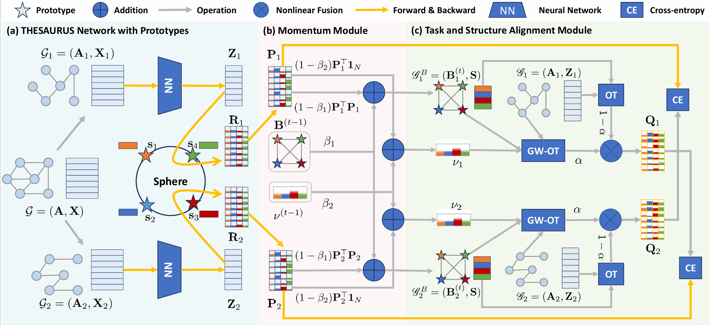

<div align="center">
<h3> THESAURUS: Contrastive Graph Clustering by Swapping Fused Gromov-Wasserstein Couplings</h3>
Bowen Deng<sup>1*</sup>, Tong Wang<sup>1*</sup>, Lele Fu<sup>1</sup>, Sheng Huang<sup>1</sup>, Chuan Chen<sup>1</sup>, and Tao Zhang<sup>1</sup>.

<sup>1</sup> Sun Yat-sen University

Full version available at arXiv ([arXiv:2412.11550](https://arxiv.org/abs/2412.11550))

</div>

<!-- 第一张图：算法框架图 -->
<div align="center">
  
  <p><em>Algorithm Framework</em></p>
</div>

<!-- 第二行：两个可视化对比图并排 -->
<div align="center" style="display: flex; justify-content: center; gap: 20px;">
  <div>
    
    <p><em>Old SOTA (i.e., Dink-Net) Learned Representation</em></p>
  </div> <div>
    
    <p><em>Our Method (i.e., THESAURUS) Learned Representation</em></p>
  </div>
</div>


## Dependencies


## Dependencies

The main dependencies and their versions used in this project are:

| Library             | Version           | Library              | Version           |
|---------------------|-------------------|----------------------|-------------------|
| `faiss-gpu`         | 1.9.0             | `pytorch`            | 2.1.2             |
| `pytorch-lightning` | 2.5.0.post0       | `torch-geometric`    | 2.5.2             |
| `torch-cluster`     | 1.6.3+pt21cu121   | `torch-clustering`   | 0.0.1             |
| `torch-scatter`     | 2.1.2+pt21cu121   | `torch-sparse`       | 0.6.18+pt21cu121  |
| `torch-spline-conv` | 1.2.2+pt21cu121   | `torchaudio`         | 2.1.2             |
| `torchvision`       | 0.16.2            | `torchmetrics`       | 1.3.2             |
| `jsonargparse`      | 4.27.1            |                      |                   |

---
## Installation

To install the required dependencies, you can use Conda or any other Python environment manager:

```bash
conda create -n gnc python=3.10
conda activate gnc
conda install pytorch==2.1.2 torchvision==0.16.2 torchaudio==2.1.2 pytorch-cuda=12.1 -c pytorch -c nvidia
pip install  torch-geometric pyg_lib torch_scatter torch_sparse torch_cluster torch_spline_conv -f https://data.pyg.org/whl/torch-2.1.0+cu121.html
conda install -c pytorch -c nvidia faiss-gpu=1.9.0
pip install pytorch-lightning torchmetrics
# maker sure you are under the directory of "THESAURUS"
pip install -e . # install our gnng lib in the editable mode. 
```


## Usage

The main script to run experiments is `main_clustering.py`. 
You can specify different datasets using the `--config` flag 
followed by the corresponding configuration file:

```bash
python main_clustering.py --config configs/<your_config>.yaml
```


Replace `<data_name>` with the name of the dataset you want to use (e.g., `cora`, `citeseer`, etc.).
```bash
python main_clustering.py --config configs/cora.yaml
```
## Reproducibility
Our experiments conducted on all datasets can be reproduced by the config files under `configs/`.

## Citation
```bibtex
@inproceedings{Deng_Wang_Fu_Huang_Chen_Zhang_2025,
  title   = {THESAURUS: Contrastive Graph Clustering by Swapping Fused Gromov-Wasserstein Couplings},
  author  = {Deng, Bowen and Wang, Tong and Fu, Lele and Huang, Sheng and Chen, Chuan and Zhang, Tao},
  journal = {Proceedings of the AAAI Conference on Artificial Intelligence},
  year    = {2025},
  month   = {Apr.},
  volume  = {39},
  number  = {15},
  pages   = {16199--16207},
  doi     = {10.1609/aaai.v39i15.33779},
  url     = {https://ojs.aaai.org/index.php/AAAI/article/view/33779} 
}
```
